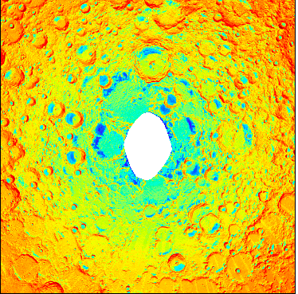
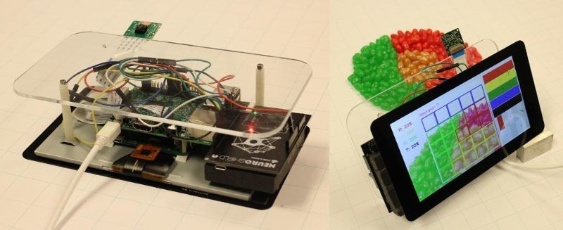

Hi I'm Chris! I am senior at the University of Hawaii majoring in Computer Science with a minor in Business.
For the 2017 - 2018 school year, I'll be doing a research project under a NASA Space Grant Fellowship and an internship under Oceanit, a scientific innovation and reseearch company located in Honolulu, Hawaii. After graduation, I hope to become a Technical Program Manager or a Software Developer.

Since September 2014, I've also been serving as a STEM Mentor for a school complex in Hawaii. My emphasis as a STEM Mentor is early Computer Science education. Part of this role involves collaborating with teachers to develop a 21st century Computer Science curriculum. I have also mentored several students with Computer Science projects for the Honolulu District, Hawaii State, and Intel International Science and Engineering Fairs.

My technical experience consists of internships at startups and large-sized companies.
Here are some highlights of my past work experiences:

<li> Oceanit: Developed two cross-platform mobile applications with Design Thinking.
<li> Ditto: Developed a website with ~200 users while conducting consumer research and Google Analytics.
<li> Oceanit: Made a video-wall using six Raspberry Pis.
<li> IBM: Developed a dependency detection microservice for IBM Watson projects following the Scrum-Agile methodology.
 
 
In my NASA Space Grant Research, I'm working on identifying "cold traps" on the Moon. Cold traps are regions on the Moon where it's cold enough to trap ice. If it's cold enough to trap ice, it's cold enough to trap water and water equals life.
 
Here is a peak-temperature map I made using UCLA's Lunar Orbiter data for the South polar region of the Moon.
You can see that the blue parts are the cold traps I was talking about:
 
 

 

At Oceanit (for round three), I am working on power line vegetation detection using a neuromorphic chip sponsored by a Korean semiconductor company.
 
My Oceanit team also developed Harvest Vision for the Hawaii AGathon. Harvest Vision is an AI camera system that improves annual coffee bean harvest yields by $250,000 using Raspberry Pis with OpenCV.
 
 

 

My experience in the Tech industry and the Education industry has shown me how to apply my technical knowledge in all situations. After college, it is my desire to work in an environment where cross-functional coordination is used deliver value to consumers and end-users.

