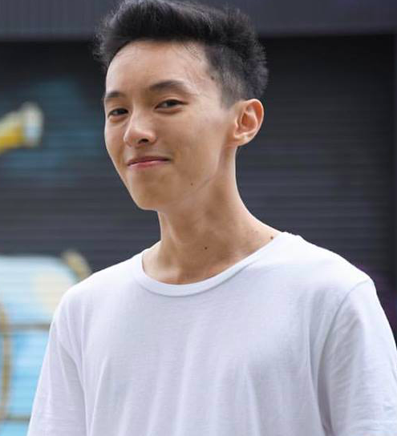

Hi I'm James! Thanks for spending the time to get to know me a bit better!
I'm currently a sophomore at Dartmouth College majoring in Computer Science modified with digital arts.

 
Put shortly, I love to create! Whether it be through code, through design, or random artwork I do on photoshop, I love to create things that are beautiful, innovative, and inspiring.
 
 

Check out my projects to see some cool things I've done/am working on!
And if you have any questions, or just want to talk, feel free to contact me through:

Email: james.j.lee.20@dartmouth.edu
 
Linkedin: www.linkedin.com/in/jamesjinlee/

Looking forward to hearing from you!
