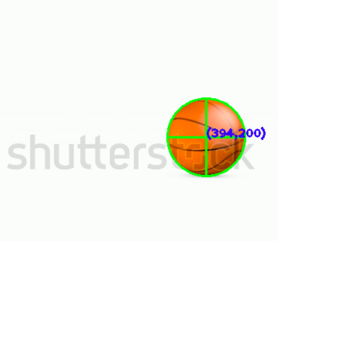
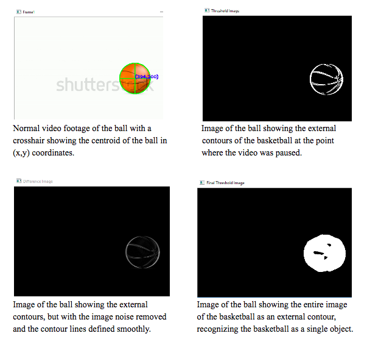
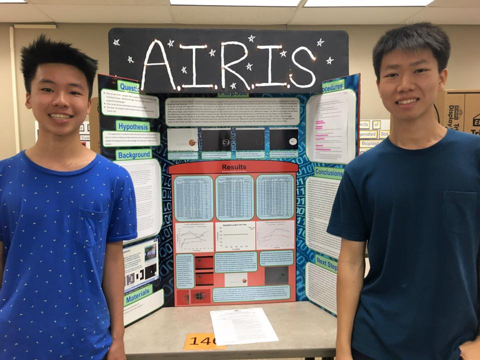

<iframe width="700" height="393.75" src="https://www.youtube.com/embed/i9uI-JIyEFI" frameborder="0" allow="autoplay; encrypted-media" allowfullscreen></iframe>

D-Path is an app that helps Dartmouth students pick courses that they should take. Users are given the list of all Dartmouth courses, and is able to rate the courses that they've already taken. D-path then recommends courses that the student might like based on other users with similar interests, like how Netflix recommends movies or how Amazon recommends products. We collected course information from various sources such as the timetable from the Dartmouth course site and the ORC, and through machine learning and collaborative filtering, created an app to revolutionize how Dartmouth students choose their classes.

I worked on this app in partnership with a fellow student. I focused on the front end application of this android app, including the layout, functionality, and UI.

Source: <a href="https://github.com/jamesjinlee/dpath"><i class="large github icon"></i>D-Path (Front End)</a>

Link: <a href="https://marshallpeng.github.io/yourdartmouthplan.me/">D-Path Website/Download APK </a>

<!-- 

AIRIS is a C++ console application using the [OpenCV](http://opencv.org/) Computer Vision library to track motion in real time through a live-video feed through a camera or a normal video file. This project was a collaborative effort for me a STEM Resource Mentor for the Hawaii State Deparment of Education's [Kaimuki-McKinley-Roosevelt Complex Area](http://www.hawaiipublicschools.org/ConnectWithUs/Organization/OfficesAndBranches/Pages/Kaimuki-McKinley-Roosevelt.aspx).

As a mentor, I was tasked with teaching two high school students how to code in C++ and use the OpenCV library for this project. For the programming side, I constructed the basic framework to track motion using the concept of [image differencing](https://en.wikipedia.org/wiki/Image_differencing) and used a Windows grid display app for validation during data collection.

To achieve real-time motion detection, AIRIS uses the concept of image differencing in which the current frame is compared to the previous frame. If the current frame is different from the previous frame then there is indeed movement.

This project won Best of Systems Software at the 2016 Honolulu District Science and Engineering Fair and was nomimated to attend the Intel Science and Engineering Fair. After the 2016 Honolulu District Science and Engineering Fair, I worked with my mentees to apply this image differencing algorithm to leukemia detection for the 2016 Hawaii State Science and Engineering Fair-- which resulted in this project receiving the University of Hawaii at Manoa Department of Information and Computer Sciences Award and 3rd Prize in Systems Software.

For this project, I learned how to research advanced topics such as Computer Vision and apply theory to code. This project also gave me the opportunity to improve my ability to teach C++ to students with no programming knowledge and work with a different age group. Learning well enough to teach others has always been a "mantra" of mine and by doing so, I became a better programmer. I definitely believe that high school students are capable of learning Computer Science.

 

 
 

This project and my mentees were also featured on Hawaii News Now on Sunrise for the [March 11](http://www.hawaiinewsnow.com/story/31448254/students-discuss-their-entries-in-the-hawaii-state-science-and-engineer-fair) airing and the [March 22](http://www.hawaiinewsnow.com/story/31539501/interview-hawaii-state-science-engineering-fair) airing.

If you want to learn more about this project, please check out this Github link below!

Source: <a href="https://github.com/chrisnguyenhi/airis"><i class="large github icon"></i>AIRIS</a> -->
