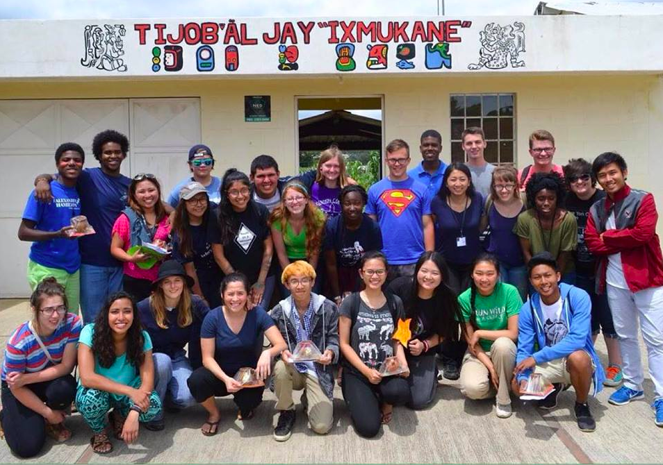
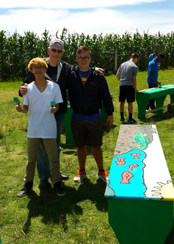

During the summer of 2015, I participated in International Leader Week 2015, a one week community service trip in [Tecpan, Guatemala](https://en.wikipedia.org/wiki/Tecp%C3%A1n_Guatemala) through [Alexander Hamilton Scholars](http://hamiltonscholars.org/1/).
This service trip was hosted by [Cross-Cultural Solutions](https://www.crossculturalsolutions.org/), an organization which allows people from the US to volunteer internationally. 

Alexander Hamilton Scholars is a scholarship that I won in my junior year of high school in 2013. Since then, the Alexander Hamilton Scholars organization have actively supported me and 25+ other Hamilton Scholars in my 2013 cohort throughout the college process (since many of us are first-gen college students). Seattle Leader Week, the Year 1 program in the summer of 2014, focused on the transition to college and defining a vision statement. Within the one week I was in Guatemala for International Leader Week 2015 for the Hamilton Year 2 program, I was able to work with my cohort to repaint "[Tijob'al Jay "Ixmukane](http://amarillasya.com/centro-educativo-ixmukane-tijobal-jay-ixmukane-135351.html)," a primary school in Tecpan and design a lesson plan to teach K-6 students English. 

From International Leader Week, I learned how to embrace other cultures, work with a language barrier (I spoke no Spanish), and collaborate with a diverse group of Hamilton Scholars from all around the nation. 
I also got beat in soccer by 2nd graders. 

Aside from repainting the school, International Leader Week also consisted of going to Mayan Ruins, seeing Guatemalan art, and understanding the political issues concerning Guatemala. 

What stood out the most to me was that the Guatemalan language, [Kaqchlcal](http://www.native-languages.org/kaqchikel.htm), is slowly being lost due to the importance that Spanish and English plays in providing opportunites. As a result, many Guatemalan children of Mayan descent grow up without learning it at all. International Leader Week was an eye-opening experience and taught me to be appreciative of everyday things such as running water or electricity-- something that many who live in first-world countries take for granted.

For more information about the Alexander Hamilton Scholars program and scholarship, please check out the link below! 

Link: <a href="http://hamiltonscholars.org/1/the-program/who-we-serve/">Alexander Hamilton Scholars</a>
