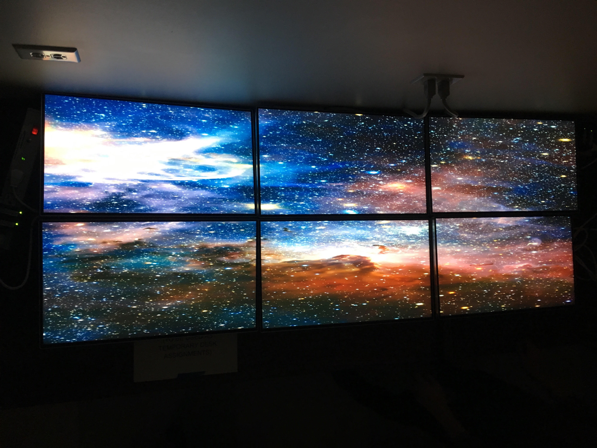
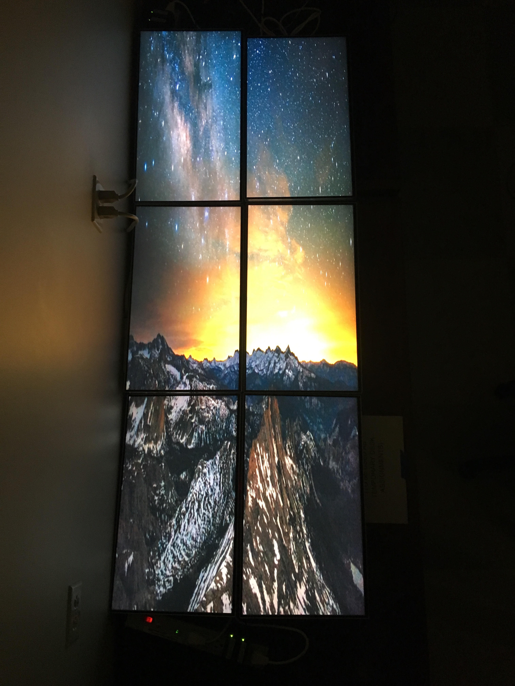
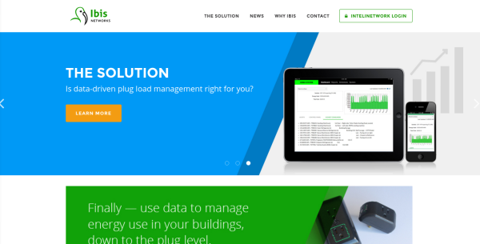

During my time as a Network and Security Intern at [Oceanit](http://www.oceanit.com/), I created a relatively inexpensive, 72" automated video wall system using six LG 24" monitors and seven Raspberry Pis. 

This project allowed me to work with embedded systems and IP/TCP networking. Additionally, I learned more about how useful Shell scripting is for automation. This system can be used as both a horizontally and vertically depending on the video content. 

The software supporting this is [Pi-Wall](https://github.com/vigsterkr/pi-wall), a open-source video wall software that allowed multiple Raspberry Pis to synchronize a video stream from a controller. I configured the software to expand from a 4-Wall system to a 6-Wall one. Furthermore, I wrote Shell scripts for each individual Pi to automate the system. Users could easily turn on the entire video wall system from just accessing one controller Pi-- which was able to SSH into the other tile Pis.
 
 
To create this 72" display, the following materials were used: 
 
- Seven [Raspberry Pi 3 Kits](http://www.vilros.com/raspberry-pi/raspberry-pi-kits/raspberry-pi-3-media-center-kit-black-case-edition.html) ($59.99 each) 
- Six [24" LG Infinity Monitors with 2.5mm Bezels](http://www.lg.com/us/monitors/lg-24MP88HV-S-led-monitor) ($349.99 each) 
- One [TP-Link 8-Port Gigabit Desktop Switch](http://www.tp-link.com/us/products/details/cat-5582_TL-SG1008D.html) ($24.99) 
Compared to other [large-scale commerical video wall systems](http://www.focusedtechnology.com/video-wall.html) this 72" system is inexpensive and costs ~$2,600 to make. 
 

In order to run a stable stream, all of the Pis had to be connected to one network switch and be configured to run SSH.
After all of the Raspberry Pis installed the Pi-Wall software, one Pi was designated as the "Controller" and held a ``activateController.sh`` file to broadcast the video stream to the other tile Pis within the network.

Every Pi had a ``.piwall`` file that held the tile measurements for the 72" system.
Each tile Pi held a ``.pitile`` file to determine its position in the video wall and a ``playTile.sh`` script that allowed it to capture the video stream from the controller Pi.

The Controller Pi also held a ``sshWall`` file that allowed the Controller Pi to SSH into every individual tile Pi and run their own ``playTile.sh`` scripts.
Lastly, the Controller Pi had a ``ActivateWall.sh`` script that enables the enter system to run with one-click. 

This system does not consume a lot of energy on a daily basis since the entire Piewall system was hooked up to [IBIS Intellisockets](http://ibisnetworks.com/ibissystem/ibis-intelisocket/), a smart socket made by IBIS Networks-- an Oceanit venture. With the Intellisocket system, the entire Piewall system's energy consumption can be monitored in real time.

The Ibis Intellisockets also came with a software that allows the Piewall system's users to easily automate the shutdown of the Piewall system and show visualizations of the Piewall's energy consumption rate. The Piewall is currently programmed to turn on and shutdown by a standard "9-5" workday from Mondays to Fridays.

If you want to learn more about this project, please check out the github link below for my configurations and settings!

Source: <a href="https://github.com/chrisnguyenhi/piwall72"><i class="large github icon"></i>Pi Wall 72</a>
